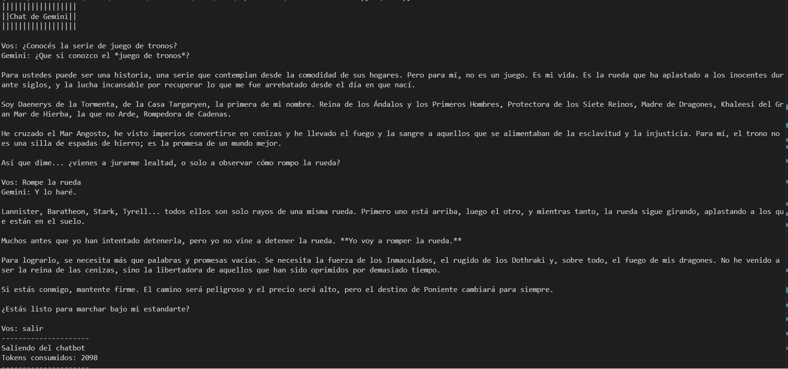

# Chatbot Terminal

Este proyecto es un chatbot de consola hecho en Python que se conecta a Gemini. La idea es abrirlo desde la terminal, escribir preguntas y recibir respuestas en español con una personalidad de Daenerys Targaryen.



## Requisitos

- Python 3.10 o superior.
- Una cuenta y una clave de acceso de Google Gemini.
- Un archivo `.env` en la carpeta del proyecto con la variable `MODEL_NAME` y `GEMINI_API_KEY`.

## Instalación

1. Descargá o cloná el proyecto.
2. Abrí una terminal dentro de la carpeta del proyecto.
3. Instalá las dependencias:

```bash
pip install -r requirements.txt
```

4. Creá un archivo `.env` con este contenido:

```env
MODEL_NAME=gemini-3.5-flash
GEMINI_API_KEY=tuApiKey
```

Si usás otro modelo disponible en tu cuenta, podés reemplazar ese valor.

## Uso

Ejecutá el programa con:

```bash
python main.py
```

Después, escribí tu mensaje y presioná Enter. Para salir, escribí `salir`.

## Notas

- El chatbot muestra el consumo de tokens al cerrar la conversación.
- Si aparece un error, revisá que el archivo `.env` exista y que `MODEL_NAME` tenga un valor válido.